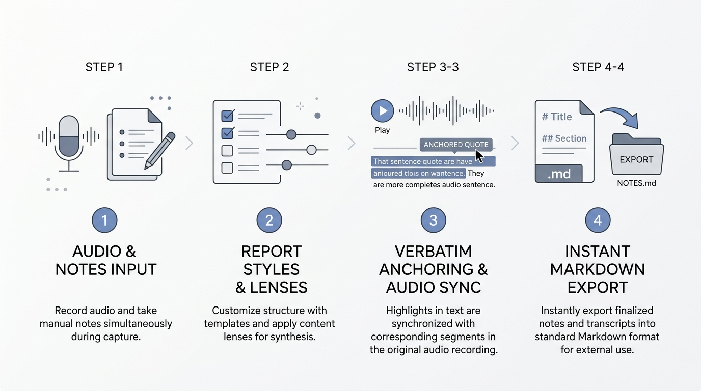
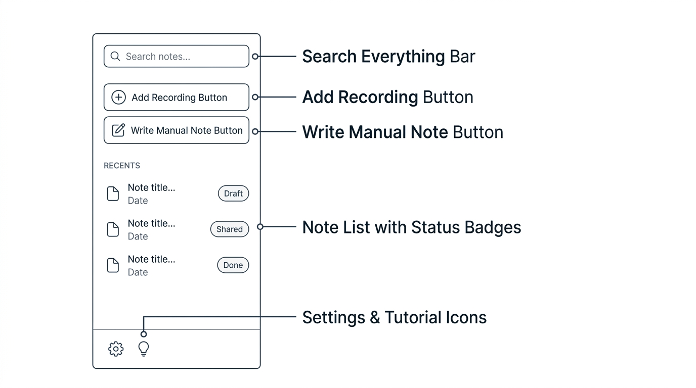
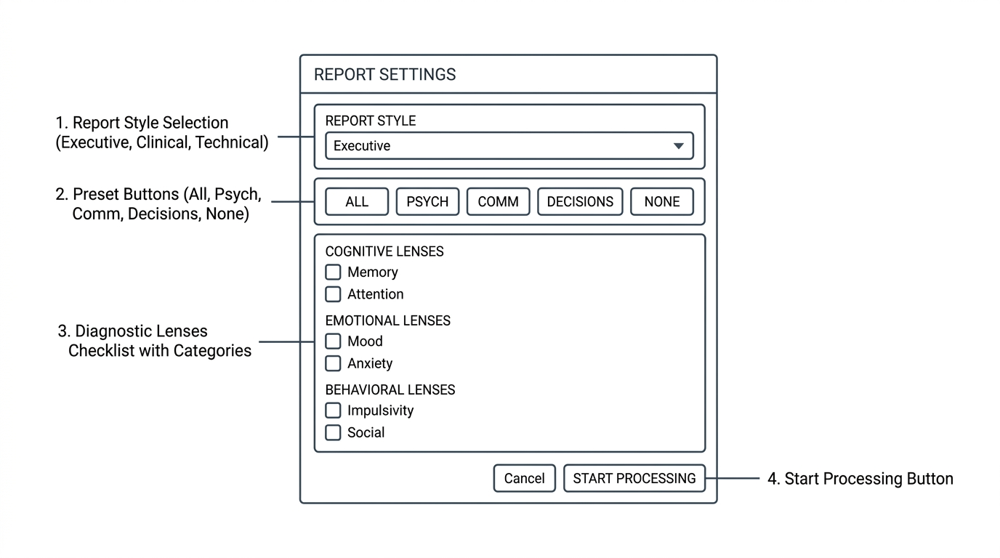
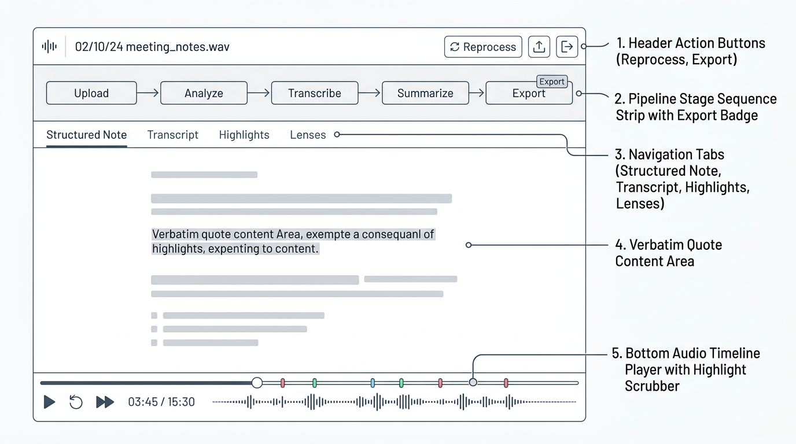

# Not3: Visual Interface Guide & Technical Manual



**Not3** is a 100% offline, local-first AI note-taking and audio analysis platform. It transcribes meetings, patient check-ins, interviews, or lectures, generates structured summaries, and runs a diagnostic library of **lenses** to identify psychological themes, conversational dynamics, and decision patterns—with every finding anchored to a verbatim quote and timestamp.

---

## 1. Sidebar Controls & Navigation



The sidebar is your main control station for adding recordings, creating notes, searching, and managing your local library:

| Control | Action | Function & Description |
|---|---|---|
| **Search Everything Bar** | `Search input` | Debounced full-text search across every segment ever spoken in your library. Typing instantly filters matches; clicking any search result opens the note and scrubs audio playback directly to that timestamp. |
| **Add Recording Button** | `+ Add recording` | Opens the native file picker to select an audio or video file (`mp3`, `wav`, `m4a`, `flac`, `mp4`, `mkv`, `mov`, etc.). Automatically prompts for report style and lens options before processing. |
| **Write Manual Note Button** | `✏ Write` | Opens the manual shorthand composer. Allows pasting fragmented phrases, abbreviations, or bullet points. Optional AI formalization restructures the text while preserving 100% of facts. |
| **Note List & Badges** | `Recent Notes` | Displays all recorded sessions sorted chronologically with title, duration, relative date, and status badges (`processing`, `done`, `failed`). Hover over any item to reveal the delete action. |
| **Settings & Tutorial Icons** | `⚙ / ✨` | `⚙ Settings` opens model and engine configuration, lens run metrics, and light/dark theme toggle. `✨ Tutorial` opens the interactive visual guide anytime. |

*💡 Tip: You can also drag and drop audio or video files directly into the window.*

---

## 2. Pre-Processing Choices: Report Styles & Lenses



When you import a file, create a manual note, or click **"Reprocess Note"**, Not3 opens the **Analysis & Diagnostic Choices Dialog**:

| Section | Callout | Options & Behavior |
|---|---|---|
| **1. Report Style Selection** | `Report Style Dropdown` | **Executive & Strategic**: Strategic takeaways, high-level commitments, operational risks.<br>**Clinical & Psychological**: Observational notes, cognitive themes, affective shifts, and evidence quotes.<br>**Technical & Architectural**: Engineering specifications, architecture diagrams, trade-offs, constraints, and action matrices.<br>**Structured Action Matrix**: High-density hierarchical bullet points with explicit ownership.<br>**Dialogue & Conversational Flow**: Speaker alignment, connection bids, consensus points, and points of friction. |
| **2. Preset Filter Buttons** | `ALL \| PSYCH \| COMM \| DECISIONS \| NONE` | One-click activation of curated lens suites:<br>• `ALL`: Runs all 8 available lenses.<br>• `PSYCH`: Activates Cognitive Distortions, Defense Mechanisms, and Emotional Arc.<br>• `COMM`: Activates Communication Patterns, Conflict Dynamics, and Empathy.<br>• `DECISIONS`: Activates Decision Biases & Strategic takeaway markers.<br>• `NONE`: Only generates distillation summary without pattern lenses. |
| **3. Diagnostic Lenses Checklist** | `Individual Lens Toggles` | Toggle specific lenses with real-time marker counts. Evaluates verbatim text against structured definitions and near-miss counter-examples. |
| **4. Start Processing Button** | `START PROCESSING` | Queues the job for the offline background worker. Only chosen lenses will execute, saving GPU memory and computation time. |

---

## 3. Note View & Interactive Timeline Player



The primary workspace for inspecting transcriptions, reading AI analysis, and verifying verbatim audio evidence:

| Component | Callout | Details & Functionality |
|---|---|---|
| **1. Header Action Buttons** | `Reprocess / Export` | **Reprocess**: Re-runs distillation or lenses with different style parameters.<br>**Export**: Opens the live Markdown export modal with one-click clipboard copy and file write actions. |
| **2. Pipeline Stage Strip** | `Stage Sequence Strip` | Displays real-time progress through the pipeline: `ingest` → `transcribe` → `diarize` → `distill` → `highlight` → `lens` → `export ↗`. Clicking the `export ↗` badge immediately opens the formatted note preview. |
| **3. Navigation Tabs** | `View Tabs` | **Structured Note**: Formatted executive/clinical summary, key takeaways, and action matrix.<br>**Transcript**: Segmented, speaker-attributed transcript with timestamps.<br>**Highlights**: Curated key moments anchored to audio timestamps.<br>**Lenses**: Categorized psychological, communication, and decision findings. |
| **4. Verbatim Quote Content Area** | `Evidence Spans` | High-precision text grounding. Every quote is anchored to the audio timeline. Clicking any highlighted quote scrubs the player directly to that second. |
| **5. Bottom Audio Timeline Player** | `Transport & Highlight Scrubber` | Standard playback controls (Play/Pause, Skip ±5s). Color-coded markers along the scrub bar indicate the exact positions of key highlights and findings. |

### Keyboard Shortcuts
* `Space`: Toggle Play / Pause
* `Shift + Left Arrow`: Skip backward 5 seconds
* `Shift + Right Arrow`: Skip forward 5 seconds

---

## 4. Markdown Export & Knowledge Base Integration

Not3 exports standard Markdown files with Obsidian-compatible YAML frontmatter:

```markdown
---
title: Q3 Product Architecture Review
date: 2026-09-21
duration: 00:14:32
speakers:
  - Alice
  - Bob
lenses:
  - decision_biases
  - defense_mechanisms
---

# Q3 Product Architecture Review

## Executive Summary
...

## Key Takeaways & Action Matrix
- [ ] Alice to prepare RFC document by Friday [00:04:12]
- [ ] Bob to benchmark database latency under load [00:08:45]

## Diagnostic Lens Findings
### Decision Biases
- **Sunk Cost Fallacy** [00:06:20]
  > *"We've already invested three months into this service, we can't abandon it now."*
  - *Rationale*: Justifying continued investment based on past unrecoverable effort rather than forward utility.
```

Files are saved locally to `%LOCALAPPDATA%\Not3\export\` (`~/Library/Application Support/Not3/export/` on macOS).
